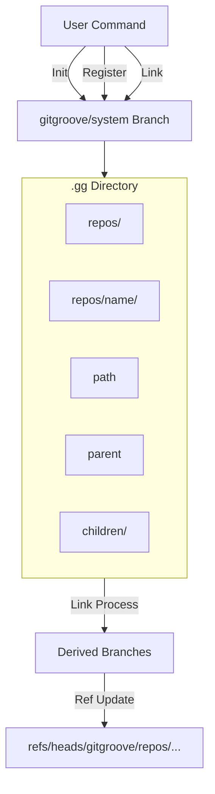

# GitGroove Core Operations: Init, Register, and Link

This document details the three fundamental operations that power GitGroove: **Init**, **Register**, and **Link**. These commands form the lifecycle of a GitGroove monorepo, transforming a standard Git repository into a managed, hierarchical system without disrupting existing workflows.

## Core Philosophy

GitGroove operates on a **metadata-first** principle:
1.  **Isolation**: All GitGroove state is stored in a hidden `.gg` directory and tracked on a dedicated orphan branch (`gitgroove/system`).
2.  **Atomicity**: Operations either fully succeed or fail without side effects. No partial states are ever committed.
3.  **Non-Intrusive**: User branches (e.g., `main`, `feature/*`) are never directly modified by GitGroove.
4.  **Deterministic**: Derived branches are purely functional projections of the committed metadata and project state.

---

## 1. Init (`grove.Init`)

**Goal**: Bootstrap a standard Git repository to be a GitGroove monorepo.

### Preconditions
*   Must be run inside the root of an existing Git repository.
*   The working tree must be **clean** (no staged, unstaged, or untracked changes).
*   GitGroove must not already be initialized (checks for `.gg` directory or `gitgroove/system` branch).

### Process
1.  **Validation**: Verifies all preconditions. Fails immediately if any check does not pass.
2.  **Structure Creation**:
    *   Creates a hidden `.gg` directory.
    *   Creates `.gg/repos` to store repository metadata.
    *   Adds a `.gitkeep` to ensure the structure is trackable.
3.  **System Branch Setup**:
    *   Creates a new branch named `gitgroove/system`.
    *   **Note**: Currently, this branches off the current HEAD.
4.  **Commit**:
    *   Stages the `.gg` directory.
    *   Commits with the message "Initialize GitGroove system branch".
    *   The user is left checked out on `gitgroove/system` to signal successful initialization.

### Outcome
A valid GitGroove "database" is established. The `gitgroove/system` branch now acts as the source of truth for the monorepo's structure.

---

## 2. Register (`grove.Register`)

**Goal**: Record the existence of sub-repositories (mapping a logical `name` to a physical `path`) without modifying user code or creating branches yet.

### Preconditions
*   **Clean Working Tree**: Required to safely switch contexts.
*   **Valid Paths**: Target paths must exist, be directories, and reside within the project root.
*   **No Nested Git**: Sub-repos cannot contain their own `.git` directories (GitGroove manages the monorepo, not submodules).
*   **Unique Identity**: Repo names and paths must be unique within the system.

### Process
1.  **Environment Check**: Verifies the repo is clean and GitGroove is initialized.
2.  **Load State**: Reads the *latest committed* state from `gitgroove/system`.
3.  **Validation**:
    *   Checks incoming repos against existing metadata for name/path collisions.
    *   Verifies filesystem existence of the paths.
4.  **Atomic Write (Temporary Workspace)**:
    *   Creates a temporary detached worktree at the tip of `gitgroove/system`.
    *   For each repo, creates a directory `.gg/repos/<name>`.
    *   Writes a `path` file containing the relative path (e.g., `services/billing`).
5.  **Commit & Update**:
    *   Stages the changes in the temporary workspace.
    *   Creates a new commit.
    *   **Atomically updates** the `gitgroove/system` ref to this new commit.

### Outcome
The repositories are now "known" to GitGroove. They have a name and a location, but no relationships or derived branches exist yet.

---

## 3. Link (`grove.Link`)

**Goal**: Define the hierarchy (parent-child relationships) and generate the actual Git branches for each repository.

### Preconditions
*   **Registered Repos**: Both parent and child must already be registered.
*   **No Cycles**: The hierarchy must be a Directed Acyclic Graph (DAG).
*   **Single Parent**: A child can only have one parent.

### Process
1.  **Validation**:
    *   Loads existing metadata.
    *   Verifies all referenced repos exist.
    *   Checks for cycles (e.g., A -> B -> A) and self-references.
    *   Ensures children don't already have parents.
2.  **Metadata Update (Temporary Workspace)**:
    *   In a detached worktree (based on `gitgroove/system`):
        *   Writes the parent's name to `.gg/repos/<child>/parent`.
        *   Creates an empty marker file at `.gg/repos/<parent>/children/<child>`.
    *   Commits these changes to `gitgroove/system`.
3.  **Branch Reconstruction**:
    *   **Reload**: Loads the full repository list from the *new* system tip.
    *   **Ancestry Tracing**: For every repo, traces the path to the root (e.g., `billing` -> `services` -> `backend`).
    *   **Ref Update**: Updates the derived branch ref:
        `refs/heads/gitgroove/repos/<path/to/repo>/branches/main`
    *   **Content**: Currently, these branches point to the project's `HEAD`.
        *   *Future*: They will point to synthetic commits containing only the relevant subtree (Sparse/Split view).

### Outcome
*   The metadata now reflects a tree structure.
*   Git refs are created for every repository, representing their "view" of the world.
*   Users can now check out these branches (e.g., `git checkout gitgroove/repos/...`) to work in an isolated context (conceptually).

---

## Summary of Data Flow

