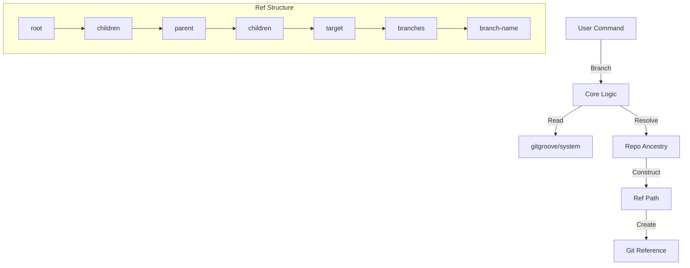

# GitGroove Branch Operation: Create Branch

This document details the **Branch** operation, which allows users to create new branches for specific nested repositories within the GitGroove monorepo system.

## Goal

To create a Git branch reference for a specific nested repository, enabling isolated development workflows on that component. The branch reference follows a hierarchical structure that reflects the repository's position in the monorepo tree.

## Command

`git grove branch <repo-name> <branch-name>`

## Preconditions

*   **Initialized & Clean**: The project must be a valid GitGroove repo with a clean working tree.
*   **Registered & Linked**: The target repository must be registered and linked within the system.
*   **Valid Names**: The repository name must exist, and the branch name must be a valid Git branch name.

## Process (`grove.CreateRepoBranch`)

1.  **Environment Validation**:
    *   Verifies the command is run inside a GitGroove repository.
    *   Ensures the working tree is clean.

2.  **Metadata Loading**:
    *   Reads the current state from `gitgroove/system`.
    *   Loads the repository graph to understand the hierarchy.

3.  **Ancestry Resolution**:
    *   Locates the target repository in the graph.
    *   Traces the ancestry chain from the target repository up to the root.
    *   Example: `child` -> `parent` -> `root`.

4.  **Ref Path Construction**:
    *   Constructs a fully qualified Git reference path using the `children` keyword to denote nesting.
    *   Format: `refs/heads/gitgroove/repos/<root>/children/<parent>/children/<child>/branches/<branch-name>`
    *   This structure explicitly maps the repository's lineage in the ref name.

5.  **Ref Creation**:
    *   Resolves the current project `HEAD` commit hash.
    *   Creates the new reference pointing to this commit.
    *   **Note**: The branch is created as a reference; it does not automatically check out the branch or modify the working tree.

## Outcome

A new Git reference is created that represents a branch *specifically* for the target nested repository.

### Example

Given a hierarchy: `backend` (child of) `services` (child of) `root`.

Running:
`git grove branch backend feature/login`

Creates the ref:
`refs/heads/gitgroove/repos/root/children/services/children/backend/branches/feature/login`

Pointing to the current commit of the monorepo.

## Data Flow

